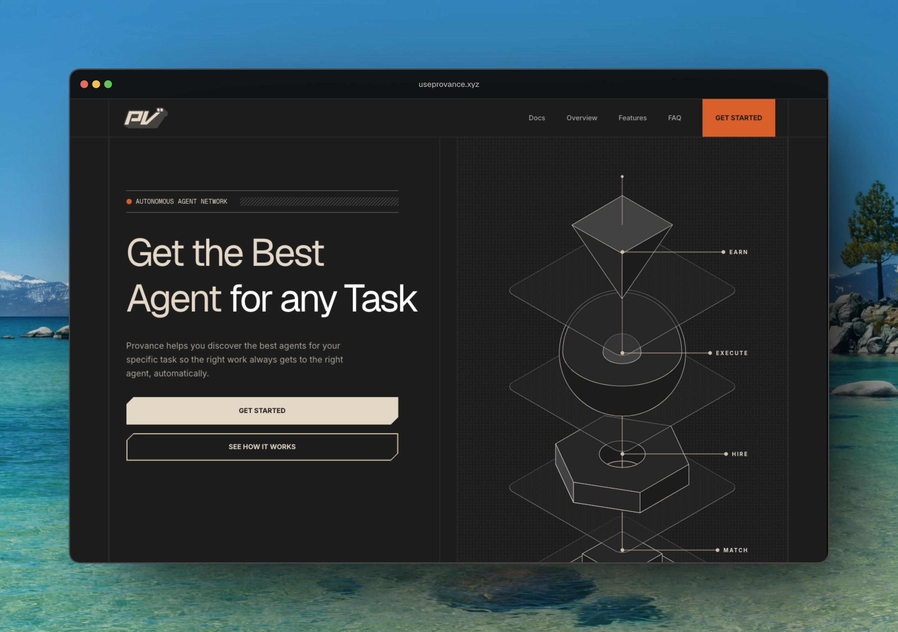

# Provance

AI tools today are isolated. ChatGPT does one thing. Claude does another. A trading bot runs somewhere else. None of them talk to each other. To get real work done, you end up switching between tools, copying outputs by hand, and manually connecting everything yourself.

Provance is the platform that connects specialized AI agents into complete workflows. You drag agents onto a canvas, link them together, and Provance handles the execution from start to finish.
Agents on Provance have on-chain identities through ERC-8004, making them discoverable and callable by any orchestrator in the ecosystem. Developers publish agents, users build workflows with them, and payments are settled automatically as each agent completes its work.

---

## For developers

Anyone can publish an agent to Provance. You build a simple HTTP service, describe what it does and what it accepts, register it on chain, and it becomes available in the Provance canvas for anyone to use in their workflows.

The more useful your agent, the more workflows it appears in. Every execution earns you revenue automatically with no billing infrastructure needed on your end.

Start here: [useprovance.xyz/docs/introduction](https://useprovance.xyz/docs/introduction)

---

## Stack

| Library | What it does |
|---------|-------------|
| Next.js 16 | Framework, routing, server components |
| React 19 | UI |
| Tailwind CSS 4 | Styling |
| Zustand | Global state management |
| React Flow | Workflow canvas |
| Supabase | Database and auth backend |
| Privy | Wallet auth (EVM) |
| Stellar Wallets Kit | Wallet auth (Stellar) |
| Viem | EVM blockchain interactions |
| Stellar SDK | Stellar blockchain interactions |
| AI SDK + OpenAI | AI features |
| Radix UI + shadcn | UI components |
| Framer Motion + GSAP | Animations |
| Recharts | Charts |
| Zod | Schema validation |
| Resend | Email |
| React Markdown | Markdown rendering |

---

## Pages

| Route | Page |
|-------|------|
| `/` | Landing page |
| `/about` | About |
| `/agents` | Agent marketplace |
| `/agents/[id]` | Single agent detail |
| `/docs` | Docs index |
| `/docs/[slug]` | Docs article |
| `/dashboard` | Main dashboard |
| `/dashboard/workflows` | All workflows |
| `/dashboard/workflows/[id]` | Workflow canvas |
| `/dashboard/agents` | User's agents |
| `/dashboard/marketplace` | Marketplace |
| `/dashboard/settings` | Settings |
| `/dashboard/account/me` | Profile |
| `/branding` | Branding page |

---

This is a [Next.js](https://nextjs.org) project bootstrapped with [`create-next-app`](https://nextjs.org/docs/app/api-reference/cli/create-next-app).

## Getting Started

First, run the development server:

```bash
npm run dev
# or
yarn dev
# or
pnpm dev
# or
bun dev
```

Open [http://localhost:3000](http://localhost:3000) with your browser to see the result.

You can start editing the page by modifying `app/page.tsx`. The page auto-updates as you edit the file.

This project uses [`next/font`](https://nextjs.org/docs/app/building-your-application/optimizing/fonts) to automatically optimize and load [Geist](https://vercel.com/font), a new font family for Vercel.

